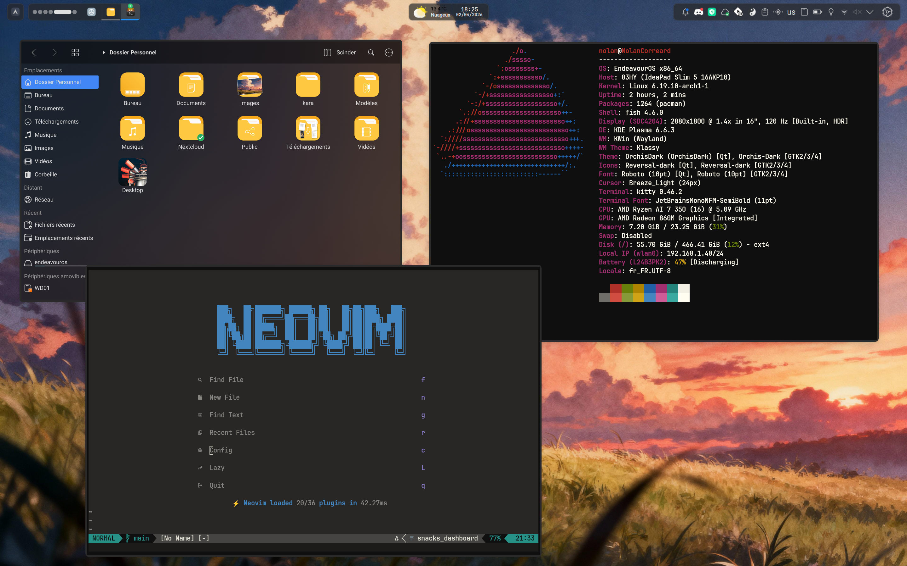
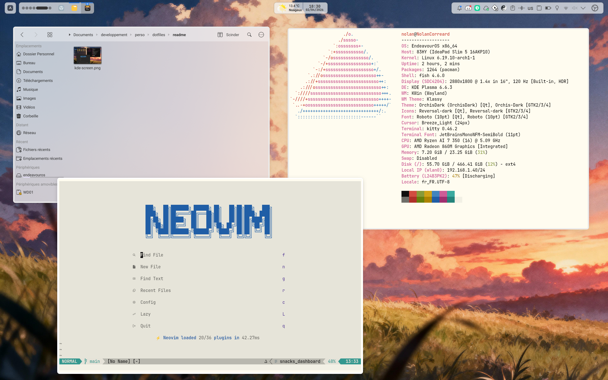

# My dotfiles

## Kde plasma 6
I switched from hyprland to KDE for more simplicity and compatibility over application and tools

### Global overview
#### Dark theme

#### Light theme

### Usefull list
- Kitty (for terminal)
- Kvantum (for better themes)
- Klassy (better window decorator)
- Panel colorizer (for best possible status bar)
- Yin Yang (For theme switching)

